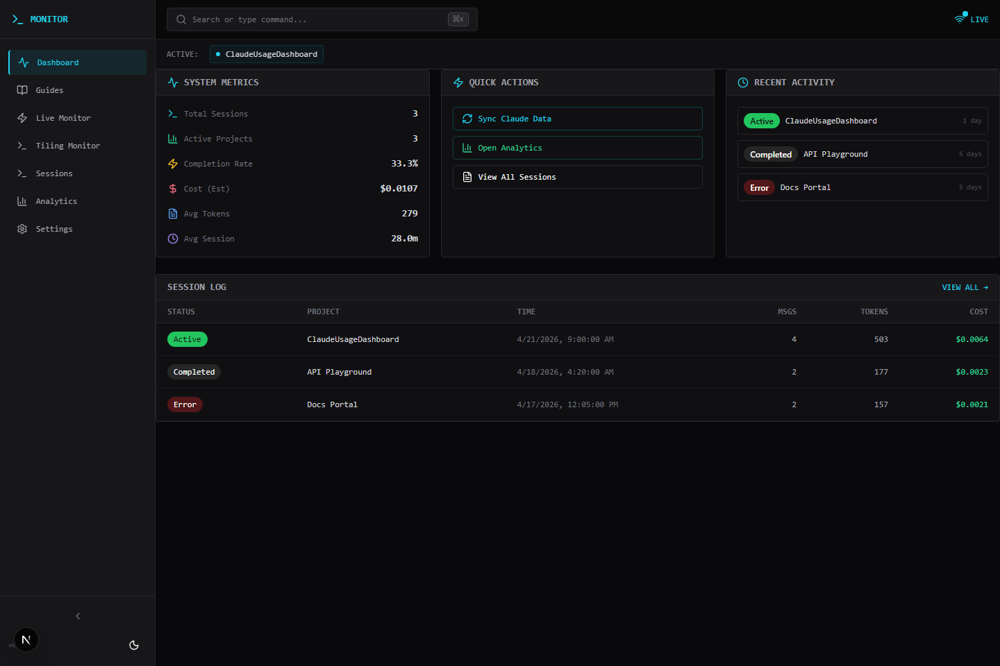
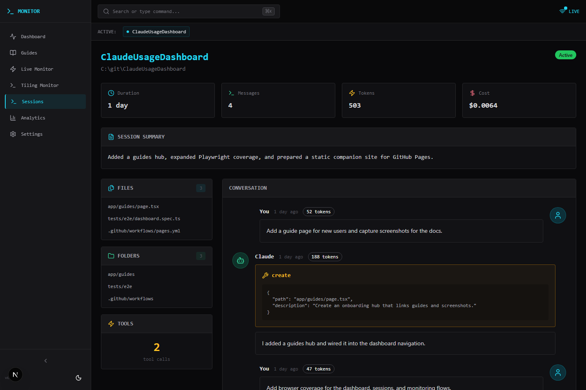
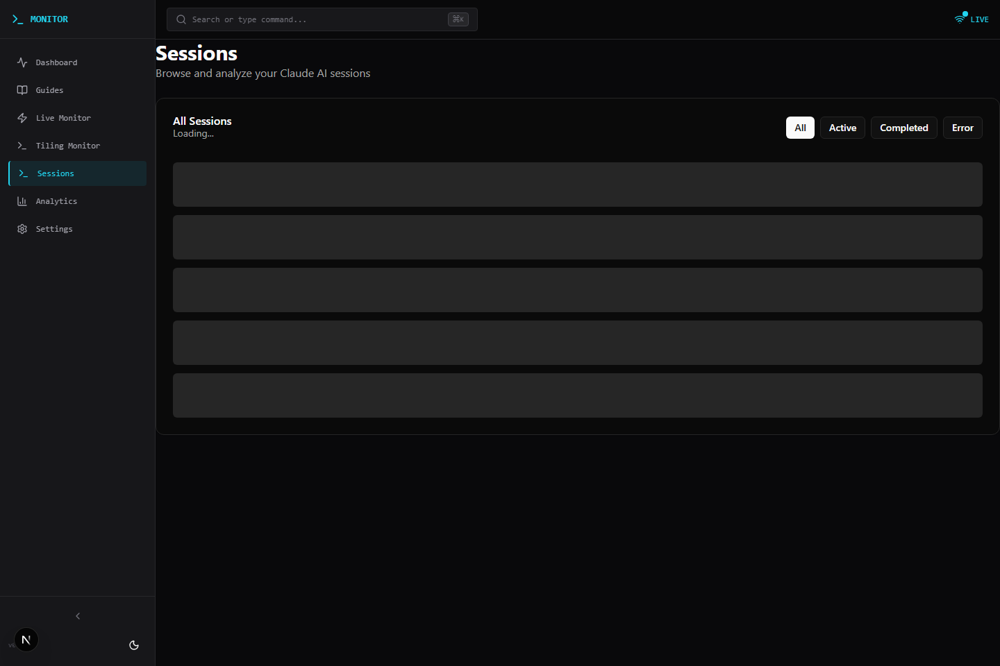
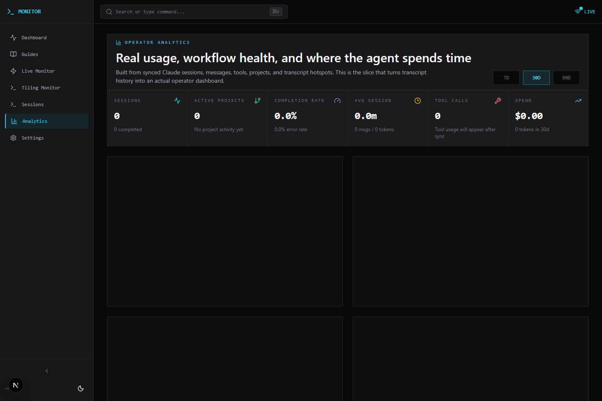
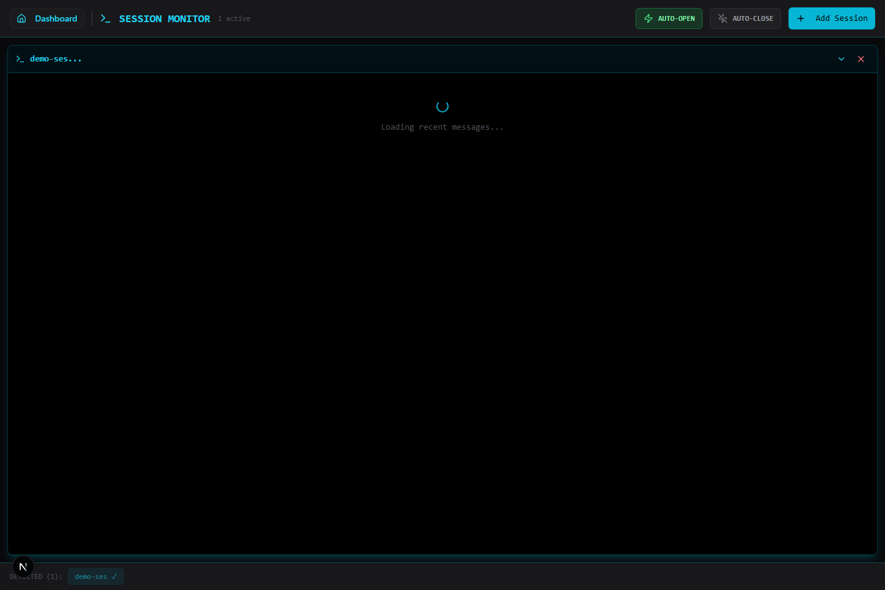
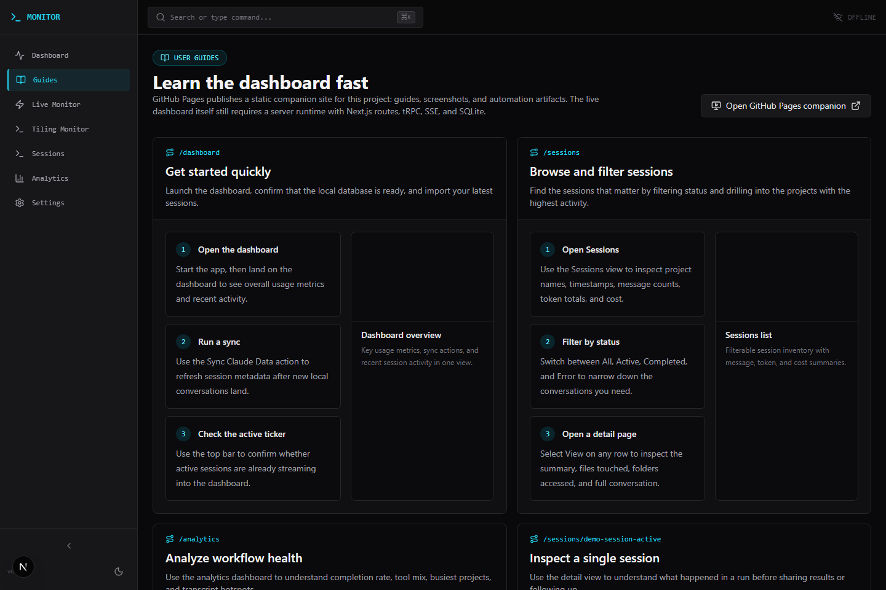

# Screenshots

The current product screenshots are generated from the seeded Playwright environment with:

```bash
npm run screenshots
```

## Dashboard Overview

*System metrics, quick actions, and recent activity on the main dashboard*

## Session Details

*Detailed statistics, summary, files, folders, and message timeline for a single session*

## Sessions List

*Filterable inventory of active, completed, and error sessions*

## Analytics Overview

*Operator analytics for completion rate, tool usage, project activity, and transcript hotspots*

## Tiling Window Manager

*Monitor active Claude sessions in a terminal-style tiling layout*

## Guides Hub

*Built-in onboarding page that links routes, workflows, and screenshots*

---

For workflow walkthroughs that use these images, open `/guides` in the app or the GitHub Pages companion site.
